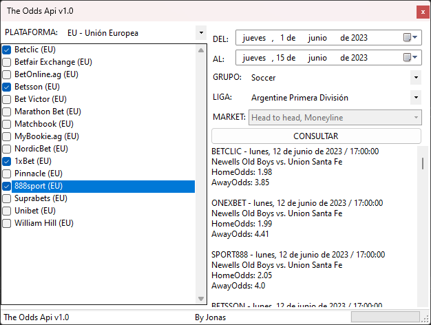

# **The Odds Api**

***Esta app es un ejemplo de uso del Api de The Odds Api, para obtener datos de las cuotas de diferentes casas de apuestas deportivas.***

* Para su realización usamos el API de Odds API.
> Sports betting API covering odds from bookmakers around the world.

Disponible en: 
[THE ODDs API ](https://the-odds-api.com/)

## **RESULTADOS OBTENIDOS**
He adaptado el formulario para faciliar el uso del API y presentar en pantalla eventos deportivos específicos. Los resultados obtenidos al final, se guardan internamente en una lista que luego puede ser usada para realizar arbitraje o algún modelo matemático para realizar apuestas.

 
### **El repositorio original se hizo con fines de realizar arbitraje, pero se deja a conveniencia el uso que le pueden dar al mismo.**
